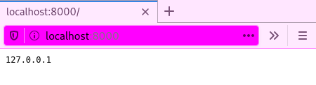

# Usage
```
$ rust-ip
listening on 0.0.0.0:8000
```
Now that the server is running on port 8000, we can connect via `rust-ip` or an HTTP client
```
$ rust-ip --client localhost:8000
127.0.0.1
```
```
$ curl localhost:8000
127.0.0.1
```
```
$ firefox localhost:8000
```
